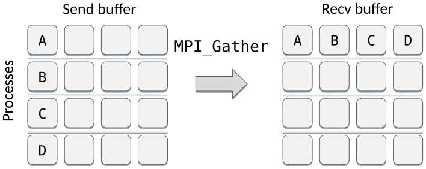
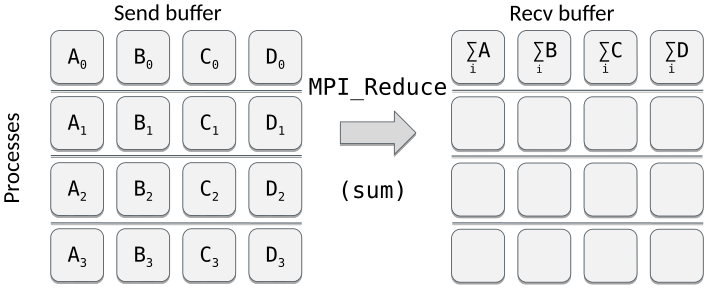

<!-- Title: Collective communication: many to one -->

<!-- Short description:

In this article we discuss how to use collective communication to collect data
from all tasks to a single task.

-->


# Collective communication: many to one

Next step is to look into how to use collective communication to collect data
from all tasks to a single task, i.e. how to move data from *many to one*.


## Gather

Gather collects an equal amount of data from all the processes in a
communicator to one process. One can think of it as an inverse scatter
operation that allows one e.g. to collect partial results from the tasks.



Segments A, B, etc. may contain multiple elements just like in scatter.

An example of gathering a list of single values (`rank`) from each process as
well as a numpy array of multiple elements (`data`) that are then stored in a
larger receive array (`buffer`):
```python
from mpi4py import MPI
from numpy import arange, zeros

comm = MPI.COMM_WORLD
rank = comm.Get_rank()
size = comm.Get_size()

data = arange(10, dtype=float) * (rank + 1)
buffer = zeros(size * 10, float)

n = comm.gather(rank, root=0)     # returns the value
comm.Gather(data, buffer, root=0) # in-place modification
```


## Reduce

Reduce gathers data from all the processes in a communicator and applies an
operation on the data before storing the result in a single process.
Essentially, it is just like gather, but with an additional operation applied
to the gathered data.



The operation that is applied on the data can be anything from a sum to a
logical XOR and anything in between. MPI supports a wide variety of operations
that can be used, including e.g. maximum value (MPI.MAX), minimum value
(MPI.MIN), summation (MPI.SUM), and product (MPI.PROD).

An example of reduction using MPI.SUM to calculate the total sum of all
received values:
```python
from mpi4py import MPI
from numpy import arange, empty

comm = MPI.COMM_WORLD
rank = comm.Get_rank()
size = comm.Get_size()

data = arange(10 * size, dtype=float) * (rank + 1)
buffer = zeros(size * 10, float)

n = comm.reduce(rank, op=MPI.SUM, root=0) # returns the value

comm.Reduce(data, buffer, op=MPI.SUM, root=0) # in-place modification
```


## Other common collective operations

Scatterv
  : each process receives different amount of data

Gatherv
  : each process sends different amount of data
