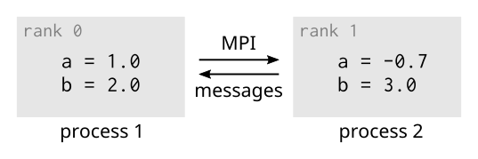

<!-- Title: Introduction to MPI -->

<!-- Short description:

In this article we give a brief introduction to the most widely used approach
for distributed parallel computing called MPI and discuss the most important
concepts to get started with parallel programming in Python.

-->


# Message passing interface

Message Passing Interface (MPI) is an application programming interface (API)
for communication between separate processes. The
[MPI standard](https://www.mpi-forum.org/docs/) defines C and
Fortran interfaces, but an unofficial Python interface is provided by
[MPI for Python](https://mpi4py.readthedocs.io) (mpi4py).

MPI programs are extremely portable and can have good performance even on the
largest of supercomputers. MPI is the most widely used approach for
distributed parallel computing with compilers and libraries available on all
typical computer architectures. Due to the widely available support, the same
MPI program can run on a wide array of computers, from laptops to large
supercomputers.

From a programmer point of view, MPI is both flexible and comprehensive. It
contains over 300 procedures, but often only a handfull of procedures are
actually needed in a single program.

MPI contains routines for:
- Communication between processes
    - sending and receiving messages between two processes
    - sending and receiving messages between several processes
- Synchronization between processes
- Communicator creation and manipulation
- Advanced features (e.g. user defined datatypes, one-sided communication
  and parallel I/O)


## Execution model

A MPI program is launched as a set of *independent*, *identical processes*.
Each process executes exactly the same program code and instructions. The
processes can reside in different CPU cores, compute nodes or even in
different computers. In principle, all that is needed is a network connection
between the processes, but in practice, a high-bandwidth, low-latency
interconnect is needed for good performance.

A special MPI launcher is needed to start a MPI program. Different systems
use different MPI launchers (depending on the MPI implementation and/or
queueing system in place), but common ones include: `mpirun`, `mpiexec`,
`aprun` and `srun`.

[Sisu](sisu.csc.fi) is a Cray system and uses `aprun`, whereas
[Taito](taito.csc.fi) uses SLURM's default `srun`.


### MPI rank

When a MPI program is launched, each process is assigned an unique ID number
called *rank*. It is possible to query the rank within a program and to
perform different tasks based on it. In fact this is the basis on which all
logic for parallelism is built on in a MPI program.

```python
if (rank == 0):
    # do something
elif (rank == 1):
    # do something else
else:
    # all other processes do something different
```

### MPI communicator

In MPI context, a *communicator* is a special object representing a group of
processes that participate in communication. When a MPI routine is called, the
communication will involve some or all of the processes in a communicator.

All processes start in a global communicator called `MPI_COMM_WORLD` (or
`MPI.COMM_WORLD` in mpi4py), but the user can also define their own custom
communicators as needed.

In C and Fortran, all MPI routines expect a communicator as one of the
arguments. In Python, most MPI routines are implemented as methods of a
communicator object.


## Data model

Since all MPI processes are completely independent, this means also a
complete separation of data. Each process has its own *separate memory space*,
i.e. all variables and data structures are local to the process. To exchange
information, processes need to explicitly *send and receive messages*.




## Getting started

To get started with MPI, it is a good idea to look into two basic methods of
a communicator object: `Get_size()` and `Get_rank()`.

These two routines can be used to find out two pieces of information that
virtually all MPI programs need, i.e. the total number of MPI processes
executing the program and the unique ID ([rank](#MPI rank)) assigned to this
process.

To be more precise, they will give you the number of processes in the
communicator and the rank within this communicator. A single process can
belong to multiple communicators and have a different rank in each one.

### Simple example: Hello world

```python
from mpi4py import MPI

comm = MPI.COMM_WORLD # communicator object containing all processes

size = comm.Get_size()
rank = comm.Get_rank()

print("I am rank %d in group of %d processes" % (rank, size))
```

### Running the example program

```bash
$ mpirun -np 4 python3 hello.py

I am rank 2 in group of 4 processes
I am rank 0 in group of 4 processes
I am rank 3 in group of 4 processes
I am rank 1 in group of 4 processes
```
