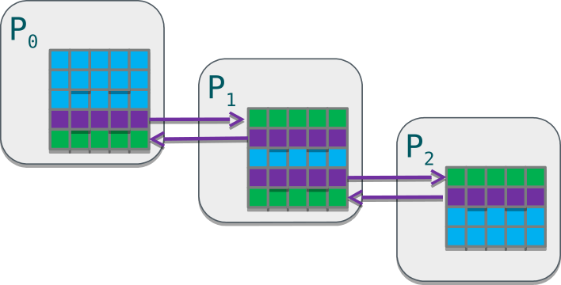

# Non-blocking communication

So far, we have been looking at communication routines that are blocking, i.e.
the program is stuck waiting as long as communication is taking place.
Blocking routines will exit only once it is safe to access the data involved
in the communication. Even though some MPI implementations may e.g. cache the
data to be sent and release the call before the receive happens, it is not
guaranteed and certainly not something to rely on.

Besides blocking communication, MPI supports also non-blocking communication.
In non-blocking communication, the communication will happen in the background
while the process is free to do something else in the mean time. Usually this
means doing some local calculations while waiting for some synchronisation
with neighbouring processes to be finished.

The key differences are:
  - methods are called `isend`, `irecv`, `Isend`, etc.
  - call will return immediately (communication happens in the background)
  - return value is a `Request` object

Using non-blocking communication allows concurrent computation and
communication and avoids many common deadlock situations. Non-blocking
communication is usually the smart way to do point-to-point communication in
MPI.


## Finalise communication

All non-blocking communication needs to be finalised at some point. One can
either wait for the communication to be finished or test the current status.

If you want to wait for the communication started with `isend` or `irecv` (or
`Isend` etc.) to finish, you can simply use `wait()`. It is a blocking call
that will wait until the communication referred to by the `Request` object is
finished.

To test whether a non-blocking communication is finished or not, you can use
`test()`. It is a non-blocking call that will return `True` if the
communication is finished and `False` if not. The status (True/False) is
contained in a tuple where the second element is the return value from the MPI
call. For example, for a finished `irecv()` this would be the received data,
whereas for `Irecv()`it would be `None`.

You can mix non-blocking and blocking point-to-point routines. So, for example
it is perfectly fine to receive a message sent with `isend()` using `recv()`.


## Example: non-blocking send/receive

```python
rank = comm.Get_rank()
size = comm.Get_size()

if rank == 0:
    data = arange(size, dtype=float) * (rank + 1)
    req = comm.Isend(data, dest=1)    # start a send
    calculate_something(rank)         # .. do something else ..
    req.wait()                        # wait for send to finish
    # safe to read/write data again

elif rank == 1:
    data = empty(size, float)
    req = comm.Irecv(data, source=0)  # post a receive
    calculate_something(rank)         # .. do something else ..
    req.wait()                        # wait for receive to finish
    # data is now ready for use
```


## Multiple non-blocking operations

Functions `waitall()` and `waitany()` may come handy when dealing with
multiple non-blocking operations (available in the `MPI.Request` class). As
the names imply, *waitall* will wait for all initiated requests to complete
and *waitany* will wait for one of the initiated requests to complete.

For example, assuming `requests` is a list of request objects, one can wait
for all of them to be finished with:
```python
MPI.Request.waitall(requests)
```

Similar functions are also available for testing multiple requests.

### Example: non-blocking message chain

```python
from mpi4py import MPI
import numpy

comm = MPI.COMM_WORLD
rank = comm.Get_rank()
size = comm.Get_size()

data = numpy.arange(10, dtype=float) * (rank + 1)  # send buffer
buffer = numpy.zeros(10, dtype=float)              # receive buffer

tgt = rank + 1
src = rank - 1
if rank == 0:
    src = MPI.PROC_NULL
if rank == size - 1:
    tgt = MPI.PROC_NULL

req = []
req.append(comm.Isend(data, dest=tgt))
req.append(comm.Irecv(buffer, source=src))

MPI.Request.waitall(req)
```


## Overlapping computation and communication



```python
request_in = comm.Irecv(ghost_data)
request_out = comm.Isend(border_data)
compute(ghost_independent_data)
request_in.wait()
compute(border_data)
request_out.wait()
```
