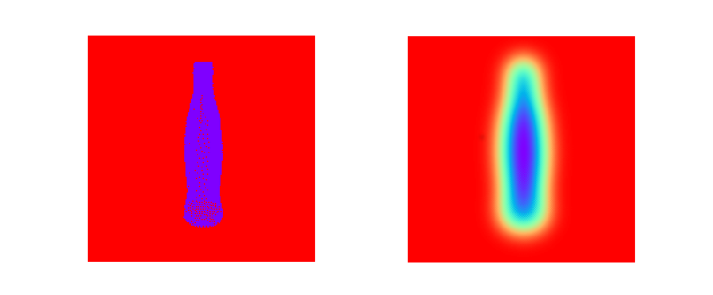

<!-- Title: Introducing heat equation -->

<!-- Short description:

In this article, we introduce the heat equation, which will be
used in various hands-on exercises throughout the course

-->

# Introducing heat equation

Heat (or diffusion) equation is a partial differential equation that
describes how the temperature varies in space over time.

The numerical solution of the heat equation contains performance aspects that
are present also in many other problems and, as such, the heat equation is
used as an example in several hands-on exercises throughout the course.

The heat equation can be written as

$$
\frac{\partial u}{\partial t} = \alpha \nabla^2 u
$$

where **u(x, y, t)** is the temperature field that varies in space and time,
and α is the thermal diffusivity constant.

The equation can be solved numerically in two dimensions by discretizing
first the Laplacian with finite differences as

$$
\nabla^2 u  = \frac{u(i-1,j)-2u(i,j)+u(i+1,j)}{(\Delta x)^2} \\
 + \frac{u(i,j-1)-2u(i,j)+u(i,j+1)}{(\Delta y)^2}
$$

Given an initial condition ($$u(t=0) = u_0$$) one can then follow the time
dependence of the temperature field with the explicit time evolution method:

$$
u_{m+1}(i,j) = u_m(i,j) + \Delta t \alpha \nabla^2 u_m(i,j)
$$

Note: the algorithm is stable only when

$$
\Delta t < \frac{1}{2 \alpha} \frac{(\Delta x \Delta y)^2}{(\Delta x)^2 (\Delta y)^2}
$$

The image below shows a result of numerical simulation where the initial state 
is a cold object in hot surroundings (for us Finns this would be a soda bottle
in the sauna) and we follow the time evolution for few hundres of time steps.

