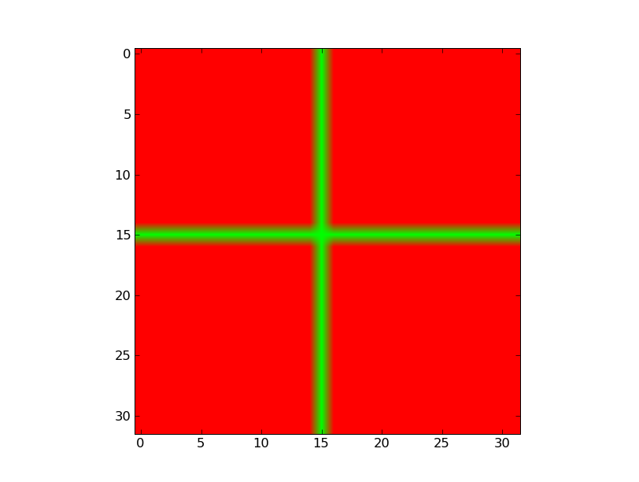

## Game of life

[Game of life](http://en.wikipedia.org/wiki/Conway's_Game_of_Life) is a cellular automaton devised by John Conway in 70's. 

The game consists of two dimensional orthogonal grid of cells. Cells are in two possible states, alive or dead. Each cell interacts with its eight neighbours, and at each time step the following transitions occur:

- Any live cell with fewer than two live neighbours dies, as if caused by underpopulation
- Any live cell with more than three live neighbours dies, as if by overcrowding
- Any live cell with two or three live neighbours lives on to the next generation
- Any dead cell with exactly three live neighbours becomes a live cell

The initial pattern constitutes the seed of the system, and the system is left to evolve according to rules. Deaths and births happen simultaneously.

Implement the Game of Life using Numpy. Try first 32x32 square grid and cross-shaped initial pattern:

Try also other grids and initial patterns (e.g. random
pattern). 

